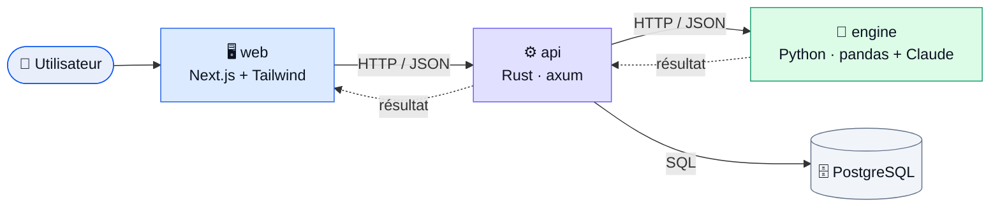
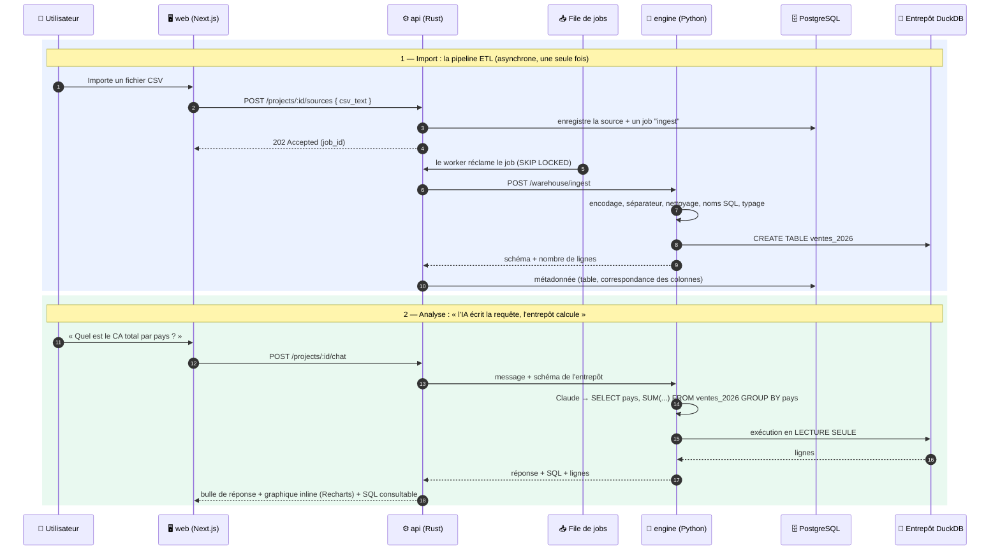
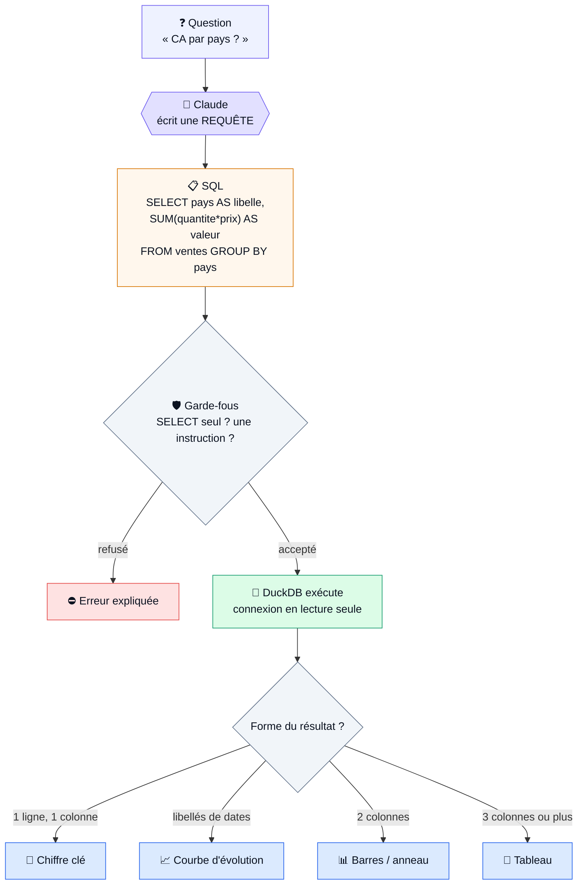

# DataVox — Comment c'est fait & comment un dataset devient un tableau de bord

Ce document explique **l'architecture** de la plateforme et, en détail, **le chemin technique
qui transforme un fichier CSV en tableau de bord** (indicateurs + graphiques + chat).

> Les diagrammes ci-dessous sont en **Mermaid** : ils s'affichent visuellement sur GitHub,
> GitLab et dans l'aperçu Markdown de VS Code.

---

## Schéma visuel

### Architecture (les 3 tiers)



### Du dataset au tableau de bord (flux technique)



### Comment une question devient un graphique



> 💡 **À retenir** : le modèle IA ne produit **jamais le chiffre** — il produit la *recette*
> (la requête). C'est l'entrepôt qui calcule sur les vraies données. D'où : aucun chiffre
> halluciné, et une recette **lisible et vérifiable** par l'utilisateur.

---

## 1. Vue d'ensemble : une architecture 3 tiers

Chaque tier a un rôle précis, et on a choisi le meilleur outil pour chacun.

```
   Navigateur
      │
      ▼
┌───────────────┐   HTTP/JSON   ┌────────────────────────┐   HTTP/JSON   ┌────────────────────────┐
│  web          │──────────────▶│  api  (Rust / axum)    │──────────────▶│  engine (Python)       │
│  Next.js      │               │  • auth JWT            │               │  FastAPI, SANS état    │
│  (UI + chat)  │◀──────────────│  • projets / datasets  │◀──────────────│  • profilage (pandas)  │
└───────────────┘               │  • quotas par palier   │               │  • KPIs déterministes  │
                                │  • file de jobs        │               │  • agents Claude       │
                                └───────────┬────────────┘               └────────────────────────┘
                                            │ SQL
                                            ▼
                                     ┌──────────────┐
                                     │  PostgreSQL  │
                                     └──────────────┘
```

| Tier | Techno | Pourquoi | Ce qu'il fait |
|------|--------|----------|---------------|
| **web** | Next.js 15 / React 19 / Tailwind | UI moderne, rendu des graphiques (Recharts) | Accueil, onboarding, **chat conversationnel**, tableau de bord |
| **api** | Rust (axum) + sqlx | Sécurité, concurrence, robustesse | Auth, projets, quotas, **file de jobs**, orchestration |
| **engine** | Python (FastAPI) | Réutilise le code data/IA **déjà vérifié** (pandas, scikit-learn, SDK Claude) | Profilage, calcul des KPIs, agents IA |
| **db** | PostgreSQL | Persistance fiable | Utilisateurs, projets, datasets, jobs, usage |

> **Décision clé** : Rust porte la *couche SaaS* (là où sa sûreté et sa performance comptent),
> Python garde *toute l'intelligence data* (là où pandas et les agents sont irremplaçables).

---

## 2. Le principe fondateur : **l'IA propose, le code calcule**

C'est le cœur de la fiabilité de la plateforme.

- Un agent IA (Claude) ne renvoie **jamais un chiffre** directement.
- Il renvoie une **requête SQL** décrivant ce qu'il faut calculer.
- Cette requête est **exécutée par l'entrepôt** sur les vraies données.

Résultat : **aucun chiffre halluciné**. Si l'assistant dit « CA total : 75 221 € », ce
nombre a été calculé par DuckDB, pas inventé par le modèle. Et contrairement à une
spec propriétaire, la requête est **lisible** : l'utilisateur peut la vérifier, la
corriger à la main, ou la reprendre ailleurs.

Exemple de requête produite par l'IA :

```sql
SELECT pays AS libelle, SUM(quantite * prix_unitaire) AS valeur
FROM ventes_2026
WHERE statut = 'Livré'
GROUP BY pays
ORDER BY valeur DESC
```

**Garde-fous** (défense en profondeur, côté `engine/app/warehouse.py`) :

1. une seule instruction, commençant par `SELECT` ou `WITH` — jamais de point-virgule ;
2. la connexion DuckDB est ouverte **en lecture seule** : même une requête qui passerait
   le premier contrôle ne pourrait rien écrire ;
3. un `LIMIT` est toujours appliqué autour de la requête ;
4. l'identifiant de projet est validé comme UUID avant de servir à construire un chemin.

Si DuckDB refuse la requête, l'erreur est renvoyée à l'agent pour **une** tentative de
correction — au-delà, on rend la main plutôt que de boucler.

---

## 3. Le voyage d'un fichier : de l'import au tableau de bord

Voici, étape par étape, ce qui se passe techniquement.

### Étape 1 — Import du fichier (web → api)

1. Dans le navigateur, le fichier CSV est lu en texte (`await file.text()`).
2. Le web envoie `POST /v1/projects/:id/sources` avec `{ filename, csv_text }`.
3. L'api (Rust) :
   - vérifie l'authentification et le **quota d'upload** du palier,
   - choisit un **nom de table** libre dans le projet (`Ventes 2026.csv` → `ventes_2026`),
   - insère la source dans `datasets`,
   - **enfile un job** `kind = 'ingest'` dans la table `jobs`,
   - répond immédiatement `202 Accepted` avec un `job_id`.

L'utilisateur n'attend pas : le traitement est **asynchrone**.

### Étape 2 — La file de jobs (worker Rust)

Un worker tourne en tâche de fond dans l'api (`worker.rs`) :

```sql
SELECT * FROM jobs WHERE status = 'queued'
ORDER BY created_at
FOR UPDATE SKIP LOCKED   -- verrou concurrent : plusieurs workers ne se marchent pas dessus
LIMIT 1;
```

Il réclame le job, le passe en `running`, puis appelle l'engine.

### Étape 3 — La pipeline ETL (engine → entrepôt)

Le worker appelle `POST /v1/warehouse/ingest`. Là, dans l'ordre :

1. **Extraction** — détection automatique de l'encodage (`chardet`) et du séparateur
   (`,` `;` tab `|`).
2. **Nettoyage** — les actions validées par l'utilisateur sont appliquées (déterministe,
   `CleaningAgent.apply_actions`).
3. **Normalisation des noms** — `« prix unitaire (€) »` devient l'identifiant SQL
   `prix_unitaire`. Le libellé d'origine est conservé dans `datasets.column_map` pour
   l'affichage : on ne perd rien, on rend juste la colonne interrogeable.
4. **Typage** — une colonne texte contenant à 95 % des nombres ou des dates est convertie.
   Sans cette étape, `SUM()` et `date_trunc()` seraient impossibles.
5. **Chargement** — `CREATE OR REPLACE TABLE` (ou `INSERT` en mode ajout) dans le fichier
   DuckDB du projet.

Le worker enregistre ensuite la métadonnée dans Postgres (`table_name`, `column_map`,
`row_count`, `status = 'ready'`, `ingested_at`) et trace le chargement dans `ingestions`.

À ce stade, les données sont **interrogeables en SQL**. C'est ce qui permet tout le reste.

### Étape 4 — Deux façons d'exploiter l'entrepôt

#### 4A. Le chat conversationnel (exploration autonome)

```
Utilisateur : « Quel est le chiffre d'affaires total par pays ? »
        │
        ▼  POST /v1/projects/:id/chat  { message, history }
   api (Rust) : vérifie le quota IA
        │
        ▼  POST /v1/warehouse/chat  { project_id, message, api_key }
   engine : lit le SCHÉMA de l'entrepôt (tables, colonnes, types, valeurs d'exemple)
        │  puis SQLAgent (Claude) renvoie
        {
          "reponse": "L'Italie est en tête…",
          "sql": "SELECT pays AS libelle, SUM(quantite*prix_unitaire) AS valeur …",
          "viz": "barres", "format": "monetaire",
          "suggestions": ["Et par produit ?", "L'évolution mensuelle ?"]
        }
        │
        ▼  l'engine EXÉCUTE le SQL sur l'entrepôt (lecture seule) → { colonnes, lignes }
        │
        ▼  le web rend : réponse + graphique + SQL consultable + bouton « épingler »
```

Les **valeurs d'exemple** du schéma comptent : c'est ce qui évite que le modèle écrive
`statut = 'livre'` alors que la donnée dit `'Livré'`.

#### 4B. Le tableau de bord (persistant)

1. `POST /v1/projects/:id/dashboard/propose` → l'IA propose 6 à 9 indicateurs, **chacun
   avec sa requête**. L'engine les exécute *avant* de répondre : un indicateur dont le SQL
   échoue n'est jamais proposé.
2. L'utilisateur décoche ce qu'il ne veut pas, puis valide → les requêtes sont enregistrées
   dans la table `widgets`.
3. `GET /v1/projects/:id/dashboard` rejoue les requêtes stockées. **Aucun appel IA** :
   rouvrir un tableau de bord est gratuit et instantané.
4. Le chat latéral (`POST …/dashboard/chat`) ajoute, modifie ou retire un indicateur en
   langage naturel. Chaque opération est **exécutée avant d'être appliquée** ; celles qui
   échouent sont écartées et expliquées plutôt qu'affichées cassées.
5. Le SQL de n'importe quel indicateur reste **modifiable à la main** (crayon sur la carte).

### Étape 5 — Mettre à jour les données

Un fichier plus récent ne débarque jamais directement dans l'entrepôt.

1. `POST /v1/sources/:id/refresh/check` compare la structure du fichier à la table
   existante — **sans rien modifier**. La comparaison nom à nom est mécanique, sans IA.
2. Trois issues :
   - **identique** → on peut charger tel quel ;
   - **compatible** → un renommage ou un réordonnancement est détecté ; si la comparaison
     mécanique ne suffit pas, `SchemaAgent` propose la correspondance, et l'utilisateur
     la valide ;
   - **incompatible** → le fichier parle d'autre chose. On l'explique en français
     (« le fichier contient des employés, la table contient des ventes ») et on s'arrête.
3. `POST /v1/sources/:id/refresh` relance la pipeline en mode `replace` ou `append`.
4. Le tableau de bord suit **tout seul** : ses requêtes sont rejouées au prochain
   affichage. Aucun indicateur à reconstruire, aucun appel IA.

---

## 4. La couche SaaS (robustesse, côté Rust)

- **Authentification** : JWT Supabase (HS256) en production ; en dev, en-tête `x-dev-user-id`.
- **Quotas par palier** : `free` (3 uploads / 10 requêtes IA par jour), `pro`, `enterprise` (illimité).
  Comptés dans `usage_events`, vérifiés avant chaque action.
- **File de jobs** : traitement asynchrone, verrou `FOR UPDATE SKIP LOCKED` (sûr en concurrence).
- **Isolation** : chaque requête est filtrée par `user_id` — un utilisateur ne voit que ses données.
- **Migrations SQL** versionnées, appliquées au démarrage de l'api.

---

## 5. Le parcours utilisateur

```
Accueil (/)  →  Connexion (/login, mode démo possible)  →  Application (/dashboard)
                                                              │
                       ┌──────────────────────────────────────┤
                       ▼ (nouvel utilisateur)                  ▼ (utilisateur avec données)
              Onboarding guidé                          Espace ▸ Projet sélectionné
              • stepper 3 étapes                         • onglet Assistant (chat SQL)
              • « Essayer avec un exemple » (1 clic)     • onglet Tableau de bord
              • ou importer son CSV                      • onglet Données (sources, mise à jour)
```

L'utilisateur organise son travail en **espaces** (un espace = un domaine, une équipe, un
client) contenant des **projets** (un projet = un entrepôt + un tableau de bord). Espaces et
projets se créent et se suppriment depuis la barre latérale ; une suppression est toujours
confirmée, car elle emporte les données.

Le bouton **« Essayer avec un jeu de données d'exemple »** (`web/lib/sampleData.ts`) crée un projet
et charge un CSV de ventes de démonstration : un nouvel utilisateur découvre tout le produit en un
clic, sans avoir de fichier.

---

## 6. Où vivent les données

**Postgres = la métadonnée** (ce qui existe, à qui, comment c'est calculé) :

```
users               (id, email, tier, …)
  └─ workspaces           (id, user_id, name, …)
       └─ projects        (id, user_id, workspace_id, name, …)
            ├─ datasets   (id, project_id, filename, table_name, column_map[jsonb],
            │              content, profile[jsonb], row_count, status, ingested_at, …)
            │    └─ ingestions (id, dataset_id, mode, verdict, row_count, detail[jsonb], …)
            ├─ jobs       (id, dataset_id, kind, status, payload[jsonb], result[jsonb], …)
            └─ dashboards (id, project_id, name, …)
                 └─ widgets (id, dashboard_id, title, sql, viz, format, position, …)
usage_events   (id, user_id, action, created_at)   ← quotas
subscriptions  (id, user_id, tier, stripe_*, …)    ← facturation (Stripe à brancher)
```

**DuckDB = les données analytiques** — un fichier `<project_id>.duckdb` par projet, dans le
volume `warehouse` monté sur l'engine. Une source = une table.

> Le point clé : `widgets.sql` stocke la **recette**, jamais le résultat. C'est ce qui rend
> le rafraîchissement des données transparent et la réouverture d'un tableau de bord gratuite.

---

## 7. Stack technique (récapitulatif)

| Composant | Technologie |
|-----------|-------------|
| Frontend | Next.js 15, React 19, TypeScript, Tailwind CSS, Recharts |
| Backend API | Rust, axum, sqlx, jsonwebtoken, tokio |
| Moteur data/IA | Python 3.11, FastAPI, pandas (< 3.0), DuckDB, scikit-learn, SDK Anthropic |
| Métadonnée | PostgreSQL 16 |
| Entrepôt analytique | DuckDB (1 fichier par projet) |
| Infra | Docker Compose (4 services + volumes `pgdata` et `warehouse`) |
| Modèle IA | `claude-sonnet-5` |

---

## 8. Décisions techniques notables

1. **DuckDB plutôt que le CSV retransporté** : auparavant le contenu du fichier repartait de
   Postgres vers Rust puis vers Python à *chaque* calcul, et était re-parsé à chaque fois —
   un tableau de bord de 8 indicateurs, c'était 8 transferts du fichier entier. Le fichier
   est désormais chargé **une fois** ; ensuite on ne déplace que des requêtes et des résultats.
2. **SQL plutôt qu'une spec maison** : l'ancienne spec (`sum|mean|ratio` + `group_by`) ne
   pouvait pas exprimer une durée entre deux événements, un percentile, une comparaison de
   périodes ni un état à une date. SQL le peut, et il est **lisible par l'utilisateur** —
   ce qui sert directement le principe « pas de boîte noire ».
3. **Python conservé pour l'analyse** : le code des agents était déjà écrit et vérifié ;
   l'engine le réutilise tel quel via le contexte de build à la racine du projet.
4. **Chiffres calculés, jamais hallucinés** : les agents produisent des requêtes, l'entrepôt
   exécute.
5. **Agents sans mémoire entre deux appels** : les agents sont des singletons partagés par
   tous les utilisateurs ; `BaseAgent.ask()` repart donc systématiquement d'un historique
   vide, sinon le contexte d'un utilisateur fuiterait dans la requête du suivant. Le
   multi-tour passe explicitement par le paramètre `context`.
6. **pandas épinglé `< 3.0`** : pandas 3.0 cassait silencieusement la détection de dates des
   agents (validés sur la ligne 2.x).
7. **Correctif `base_agent`** : les modèles récents (Sonnet 5) renvoient parfois un bloc de
   *réflexion* avant le texte → on prend le premier bloc de type `text`, pas `content[0]`.
8. **Upload inline pour l'instant** : le CSV brut reste stocké en base à côté de l'entrepôt
   (utile pour rejouer une ingestion) ; pour de très gros fichiers, la prochaine étape est
   un object storage (S3/MinIO).

---

## 9. Ce qui reste (roadmap)

- **Jointures multi-tables** : l'entrepôt les supporte, l'agent SQL doit apprendre à les
  proposer (dictionnaire des relations entre sources).
- **Object storage** pour les gros fichiers.
- **Clé Anthropic par utilisateur** : c'est aussi ce qui permettra de supprimer le verrou
  global `_ai_lock`, qui sérialise aujourd'hui tous les appels IA de la plateforme.
- **Stripe** : brancher les webhooks sur la table `subscriptions` (paliers/quotas déjà actifs).
- **Connecteurs API** (Jira en premier) sur la même file de jobs que les fichiers.
- **Rapport PDF** partageable.
- **Tests automatisés + CI**, auth SSR durcie.

---

## Lancer le projet

```bash
cd saas
cp .env.example .env        # AUTH_MODE=dev par défaut (pas de Supabase requis)
docker compose up --build
```

Application : **http://localhost:3001** — API : **http://localhost:8090**.
